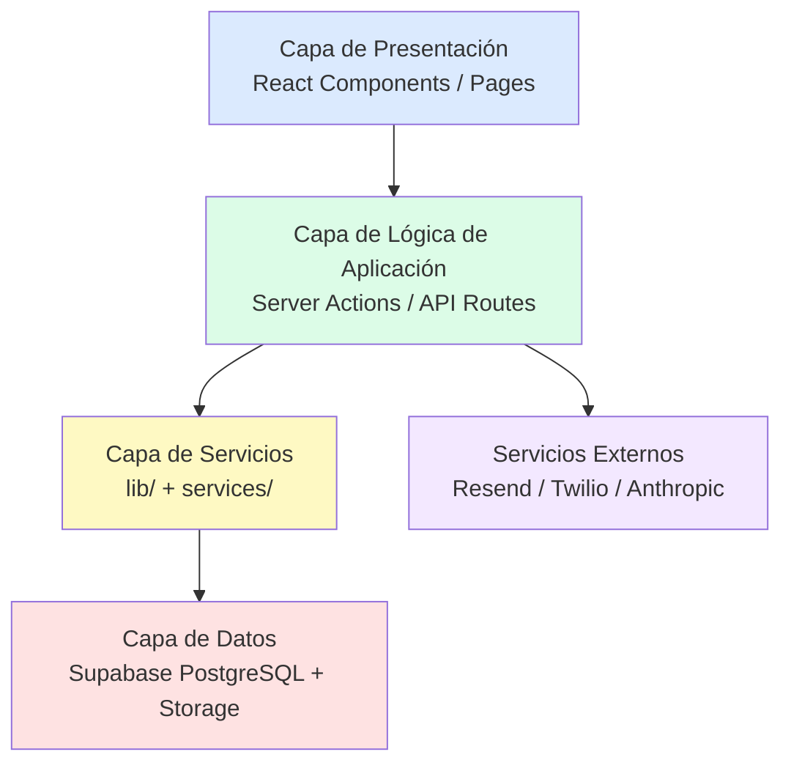
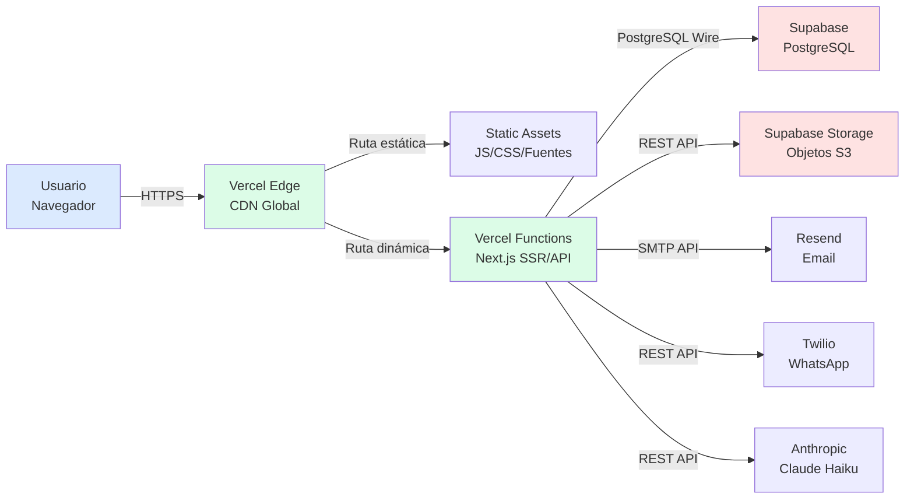
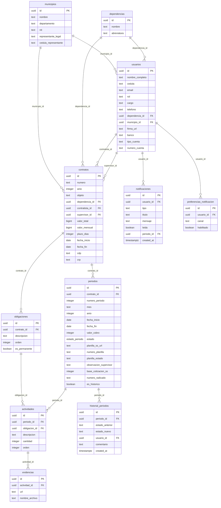
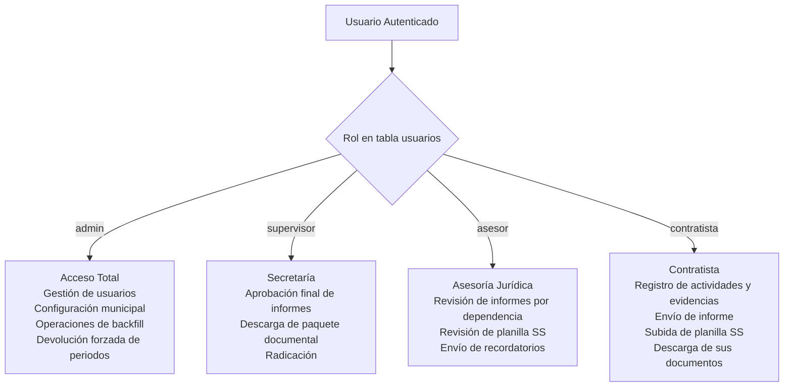
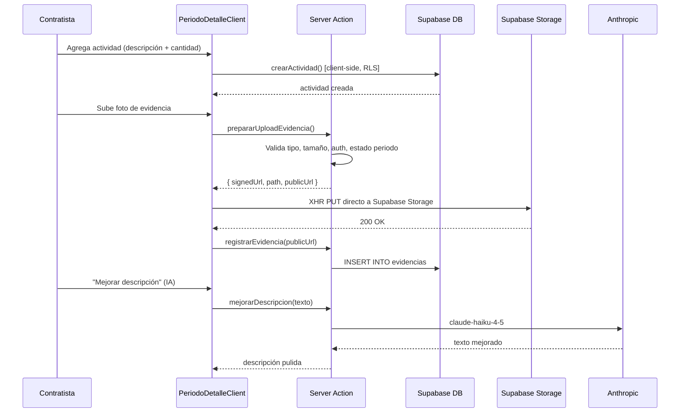
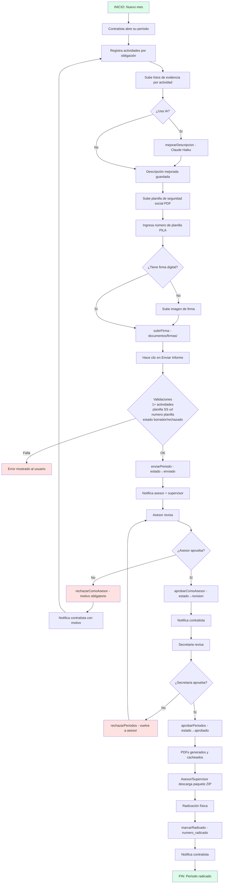
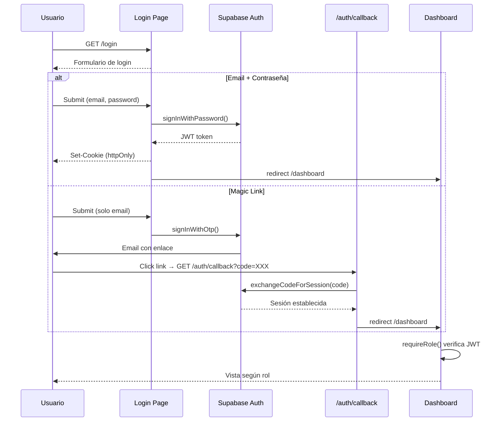
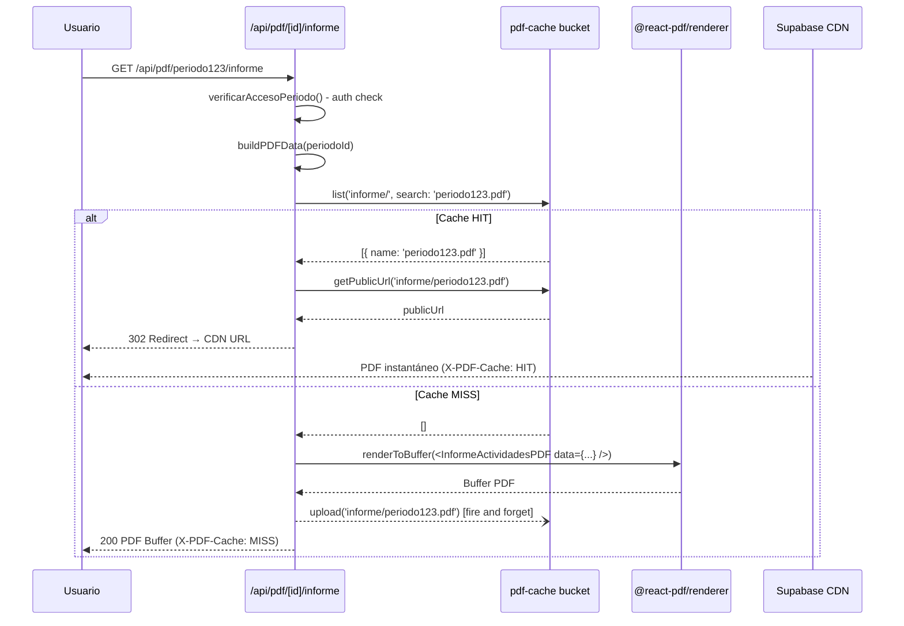
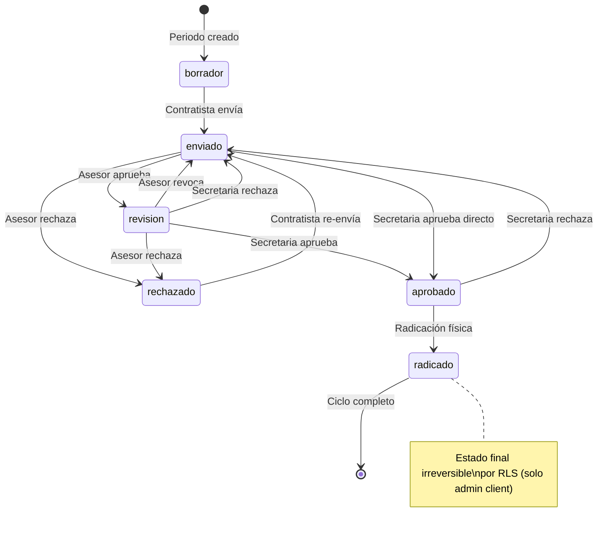
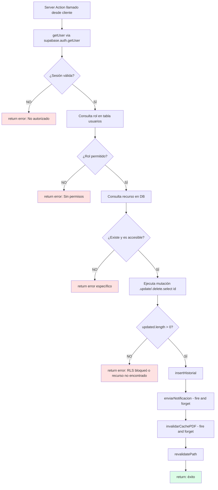

# MATERIAL AUXILIAR TÉCNICO PARA REGISTRO DE DERECHOS DE AUTOR DE SOFTWARE

---

&nbsp;

&nbsp;

# CONTRATISTA DIGITAL

### Sistema de Gestión Documental para Contratos de Prestación de Servicios de Entidades Públicas

&nbsp;

**Versión:** 1.0.0  
**Autor:** Felipe Restrepo Ceballos  
**Fecha de elaboración:** Mayo 2026  
**Tipo de software:** Aplicación web de gestión documental y administrativa  
**Clasificación:** Software original de desarrollo propio  
**Dominio de producción:** https://contratistadigital.com  

&nbsp;

---

*Este documento ha sido elaborado con fines de registro y protección de derechos de autor ante las autoridades competentes. Contiene descripción técnica exhaustiva, arquitectura, lógica de negocio, base de datos, flujos operativos y componentes originales del sistema.*

---

&nbsp;

&nbsp;

---

## TABLA DE CONTENIDO

1. [Introducción](#1-introducción)
2. [Descripción General del Sistema](#2-descripción-general-del-sistema)
3. [Arquitectura del Software](#3-arquitectura-del-software)
4. [Estructura del Proyecto](#4-estructura-del-proyecto)
5. [Base de Datos](#5-base-de-datos)
6. [Sistema de Autenticación y Seguridad](#6-sistema-de-autenticación-y-seguridad)
7. [Funcionalidades Principales](#7-funcionalidades-principales)
8. [Flujo Operacional del Sistema](#8-flujo-operacional-del-sistema)
9. [APIs e Integraciones](#9-apis-e-integraciones)
10. [Procesamiento y Automatizaciones](#10-procesamiento-y-automatizaciones)
11. [Manejo de Archivos y Recursos](#11-manejo-de-archivos-y-recursos)
12. [Interfaz de Usuario](#12-interfaz-de-usuario)
13. [Módulos del Sistema](#13-módulos-del-sistema)
14. [Lógica de Negocio](#14-lógica-de-negocio)
15. [Tecnologías y Dependencias](#15-tecnologías-y-dependencias)
16. [Originalidad y Desarrollo Propio](#16-originalidad-y-desarrollo-propio)
17. [Conclusiones Técnicas](#17-conclusiones-técnicas)
18. [Anexos Técnicos](#18-anexos-técnicos)

---

&nbsp;

## 1. INTRODUCCIÓN

### 1.1 Objetivo del Sistema

**Contratista Digital** es un sistema de información web diseñado para automatizar, digitalizar y centralizar la gestión documental de contratos de prestación de servicios en entidades públicas colombianas. El sistema permite que contratistas, asesores jurídicos, supervisores y administradores interactúen dentro de un flujo de trabajo estructurado y auditado para la producción, revisión, aprobación y radicación de informes de actividades mensuales y los documentos contractuales asociados.

### 1.2 Contexto del Problema

En las alcaldías municipales y entidades públicas de Colombia, la gestión de los contratos de prestación de servicios implica la producción mensual de un conjunto de documentos oficiales: el **Informe de Actividades**, la **Cuenta de Cobro**, el **Acta de Supervisión** y el **Acta de Pago**. Estos documentos deben seguir formatos institucionales específicos, pasar por cadenas de revisión y aprobación que involucran múltiples actores, y finalmente ser físicamente radicados.

Antes de la existencia de este sistema, este proceso era completamente manual, dependiente de plantillas en Word y Excel, correos electrónicos desorganizados y ausencia de trazabilidad. Los problemas resultantes incluían:

- Pérdida de documentos y versiones desactualizadas.
- Descoordinación entre contratistas, asesores y secretaría.
- Ausencia de historial de revisiones y aprobaciones.
- Errores en el cálculo de valores monetarios y fechas.
- Imposibilidad de seguimiento en tiempo real del estado de cada informe.

### 1.3 Finalidad del Software

Contratista Digital resuelve esta problemática mediante:

- Un flujo de trabajo digital completamente auditado con estados bien definidos.
- Generación automática de documentos PDF con formato institucional exacto.
- Sistema de notificaciones multicanal (web, correo electrónico, WhatsApp).
- Control de acceso por roles con políticas de seguridad a nivel de base de datos.
- Almacenamiento centralizado de evidencias fotográficas y documentos de soporte.
- Asistencia inteligente para la redacción de actividades mediante inteligencia artificial.

### 1.4 Alcance

El sistema cubre el ciclo completo de gestión de contratos de prestación de servicios, desde la creación del contrato hasta la radicación del informe mensual. Está diseñado inicialmente para la **Alcaldía Municipal de Fredonia, Antioquia**, pero su arquitectura es completamente escalable a cualquier entidad pública colombiana mediante configuración de parámetros municipales, sin necesidad de modificaciones al código fuente.

---

&nbsp;

## 2. DESCRIPCIÓN GENERAL DEL SISTEMA

### 2.1 Visión General

Contratista Digital opera como una aplicación web de página única con renderizado en servidor (*Server-Side Rendering*), accesible desde cualquier dispositivo con navegador moderno. El sistema centraliza en una única plataforma todos los procesos que anteriormente requerían múltiples herramientas y comunicaciones informales.

### 2.2 Tipo de Arquitectura

El sistema utiliza una **arquitectura de tres capas** (presentación, lógica de negocio y datos) implementada sobre el paradigma de **Aplicación Web Full-Stack** con las siguientes características:

- **Renderizado híbrido**: componentes de servidor para datos críticos y autenticación; componentes de cliente para interactividad.
- **Sin servidor explícito**: la lógica de negocio se ejecuta en funciones serverless de Vercel, eliminando la necesidad de administrar infraestructura de servidor.
- **Base de datos gestionada**: PostgreSQL completamente administrado por Supabase, con políticas de seguridad de fila (*Row Level Security*) que garantizan aislamiento de datos por usuario a nivel de base de datos.
- **Almacenamiento de objetos**: archivos binarios (imágenes, PDFs) gestionados por Supabase Storage con URLs públicas y firmadas según el tipo de recurso.

### 2.3 Tecnologías Principales

| Capa | Tecnología | Versión | Función |
|---|---|---|---|
| Framework Web | Next.js | 16.1.7 | Framework full-stack con App Router |
| Lenguaje | TypeScript | 5.x | Tipado estático en todo el proyecto |
| UI | React | 19.2.3 | Componentes de interfaz |
| Estilos | Tailwind CSS | 4.x | Sistema de diseño utilitario |
| Base de datos | PostgreSQL (Supabase) | 15+ | Almacenamiento relacional |
| Autenticación | Supabase Auth | 2.99+ | JWT + cookies de sesión |
| Almacenamiento | Supabase Storage | 2.99+ | Archivos binarios |
| Despliegue | Vercel (Pro) | — | Hosting serverless |
| Email | Resend | 6.9.4 | Envío de notificaciones por correo |
| WhatsApp | Twilio | 5.13.1 | Notificaciones por mensajería |
| PDF | @react-pdf/renderer | 4.3.2 | Generación de PDFs institucionales |
| ZIP | JSZip | 3.10.1 | Empaquetado de documentos |
| IA | Anthropic Claude | 0.90.0 | Asistencia en redacción |

### 2.4 Componentes Principales

```
┌─────────────────────────────────────────────────────────────────┐
│                        CONTRATISTA DIGITAL                       │
│                                                                  │
│  ┌──────────────┐  ┌──────────────┐  ┌──────────────────────┐  │
│  │   Frontend   │  │   Backend    │  │     Base de Datos    │  │
│  │   React/TSX  │  │  Server      │  │     PostgreSQL       │  │
│  │   Tailwind   │  │  Actions     │  │     Supabase         │  │
│  │   Next.js    │  │  API Routes  │  │     RLS Policies     │  │
│  └──────────────┘  └──────────────┘  └──────────────────────┘  │
│                                                                  │
│  ┌──────────────┐  ┌──────────────┐  ┌──────────────────────┐  │
│  │   Generación │  │ Notificación │  │    Almacenamiento    │  │
│  │   de PDFs    │  │  Multicanal  │  │    de Archivos       │  │
│  │  react-pdf   │  │  Resend+     │  │  Supabase Storage    │  │
│  │  JSZip       │  │  Twilio      │  │  CDN público         │  │
│  └──────────────┘  └──────────────┘  └──────────────────────┘  │
│                                                                  │
│  ┌──────────────────────────────────────────────────────────┐   │
│  │               Inteligencia Artificial                     │   │
│  │         Anthropic Claude Haiku — Redacción                │   │
│  └──────────────────────────────────────────────────────────┘   │
└─────────────────────────────────────────────────────────────────┘
```

### 2.5 Flujo General del Sistema

El flujo central del sistema sigue el ciclo mensual de cada contratista:

1. El **administrador** crea el contrato y configura los periodos de pago.
2. El **contratista** registra sus actividades realizadas durante el mes con evidencias fotográficas, sube la planilla de seguridad social y envía el informe.
3. El **asesor jurídico** revisa el informe y lo marca como revisado (o lo rechaza).
4. El **supervisor/secretaria** realiza la aprobación final.
5. El sistema genera automáticamente todos los documentos PDF institucionales.
6. Los documentos son radicados con número de radicado físico.
7. En cualquier etapa, los actores reciben notificaciones por web, correo o WhatsApp.

---

&nbsp;

## 3. ARQUITECTURA DEL SOFTWARE

### 3.1 Arquitectura Lógica

El sistema implementa una **arquitectura de capas bien definidas** con separación estricta de responsabilidades:



**Capa de Presentación**: Componentes React que se ejecutan en el navegador del usuario. Reciben datos pre-renderizados del servidor y manejan interacciones del usuario. No acceden directamente a la base de datos.

**Capa de Lógica de Aplicación**: *Server Actions* de Next.js 14 y *Route Handlers* de la API. Se ejecutan exclusivamente en el servidor de Vercel (funciones serverless). Contienen toda la validación de negocio, verificación de autenticación y autorización.

**Capa de Servicios**: Módulos en `lib/` y `services/` que encapsulan consultas a Supabase, transformaciones de datos y lógica reutilizable.

**Capa de Datos**: Base de datos PostgreSQL de Supabase con RLS (Row Level Security) activo en todas las tablas. Las políticas de seguridad son la última línea de defensa a nivel de datos.

### 3.2 Arquitectura Física



### 3.3 Arquitectura Cliente-Servidor

Next.js 14 con App Router implementa el paradigma **React Server Components (RSC)** que distingue claramente:

| Tipo | Ubicación | Acceso a DB | Interactividad |
|---|---|---|---|
| Server Components (default) | Servidor Vercel | Directo via Supabase | No (solo render) |
| Client Components (`'use client'`) | Navegador | Indirecto via Server Actions | Sí |
| Server Actions (`'use server'`) | Servidor Vercel | Directo via Supabase | Invocadas desde cliente |
| Route Handlers (API) | Servidor Vercel | Directo via Supabase | REST HTTP |

### 3.4 Separación de Responsabilidades

El diseño sigue el principio de **separación de responsabilidades** en múltiples dimensiones:

- **Seguridad por capas**: La validación de permisos ocurre (1) en el componente de UI, (2) en el Server Action, y (3) en la política RLS de la base de datos. Un fallo en cualquiera de las dos primeras capas no compromete los datos gracias a la tercera.
- **Dos clientes de Supabase**: `createServerSupabaseClient()` usa la clave anónima y respeta RLS; `createAdminSupabaseClient()` usa la clave de servicio y bypasa RLS. Solo se usa el cliente admin cuando la operación es privilegiada y previamente autorizada en código.
- **Server Actions vs. Client Services**: Las mutaciones de datos van siempre por Server Actions. Las lecturas pueden usar servicios del cliente cuando el rendimiento lo justifica y los datos no son sensibles.

### 3.5 Patrones de Diseño Detectados

| Patrón | Implementación |
|---|---|
| **Repository Pattern** | `services/*.ts` encapsulan consultas Supabase |
| **State Machine** | Máquina de estados de periodos con transiciones validadas |
| **Optimistic Lock** | `.select('id')` post-UPDATE para verificar filas afectadas |
| **Presigned URL** | Subida de evidencias: validar en servidor, subir desde cliente |
| **Cache-Aside** | PDFs cacheados en Storage; invalidación explícita en cambio de estado |
| **Fire and Forget** | Notificaciones y caché no bloquean la respuesta principal |
| **Factory Pattern** | `buildPDFData()` construye DTO unificado para todos los PDFs |
| **Strategy Pattern** | Plantillas de email/WhatsApp/app intercambiables por tipo |
| **Guard Clause** | Validaciones en cascada al inicio de cada server action |

### 3.6 Diagrama de Componentes Completo

```mermaid
graph TD
    subgraph Presentación
        L[app/login/page.tsx]
        DL[app/dashboard/layout.tsx]
        PD[PeriodoDetalleClient.tsx]
        INF[app/dashboard/informes/]
        ADM[app/dashboard/admin/]
    end
    
    subgraph ServerActions
        AP[app/actions/periodos.ts]
        AE[app/actions/evidencias.ts]
        AA[app/actions/actividades.ts]
        AADM[app/actions/admin.ts]
        AI[app/actions/ia.ts]
    end
    
    subgraph APIRoutes
        PDF1[/api/pdf/.../informe]
        PDF2[/api/pdf/.../cuenta-cobro]
        PDF3[/api/pdf/.../acta-supervision]
        PDF4[/api/pdf/.../acta-pago]
        PKG[/api/pdf/.../paquete]
    end
    
    subgraph LibCore
        SRV[lib/supabase-server.ts]
        ADC[lib/supabase-admin.ts]
        NOT[lib/notificaciones.ts]
        CACHE[lib/pdf/cache.ts]
        DATA[lib/pdf/data.ts]
        AUTH[lib/auth.ts]
    end
    
    subgraph PDFTemplates
        T1[lib/pdf/informe-actividades.tsx]
        T2[lib/pdf/cuenta-de-cobro.tsx]
        T3[lib/pdf/acta-supervision.tsx]
        T4[lib/pdf/acta-pago.tsx]
    end
    
    PD --> AP
    PD --> AE
    PD --> AA
    INF --> AP
    ADM --> AADM
    AP --> NOT
    AP --> SRV
    AE --> SRV
    AA --> SRV
    PDF1 --> CACHE
    PDF1 --> DATA
    CACHE --> T1
    DATA --> T1
    PKG --> CACHE
    NOT --> ADC
```

---

&nbsp;

## 4. ESTRUCTURA DEL PROYECTO

### 4.1 Árbol de Directorios Principal

```
contratista-digital/
├── app/                          # Next.js App Router — rutas y páginas
│   ├── layout.tsx                # Layout raíz: fuentes, metadatos globales
│   ├── page.tsx                  # Redirige al dashboard o login
│   ├── error.tsx                 # Manejador global de errores React
│   ├── globals.css               # Variables CSS de Tailwind
│   ├── auth/
│   │   └── callback/route.ts     # Intercambio de código PKCE por sesión
│   ├── login/
│   │   └── page.tsx              # Pantalla de autenticación (3 modos)
│   ├── dashboard/
│   │   ├── layout.tsx            # Sidebar + header responsive
│   │   ├── page.tsx              # Home por rol
│   │   ├── contratos/            # Gestión de contratos
│   │   │   ├── page.tsx
│   │   │   ├── nuevo/
│   │   │   └── [id]/
│   │   │       ├── page.tsx
│   │   │       ├── avanzado/
│   │   │       └── periodo/
│   │   │           └── [periodoId]/
│   │   │               ├── page.tsx
│   │   │               └── PeriodoDetalleClient.tsx   # Componente central
│   │   ├── informes/             # Vista mensual de informes
│   │   ├── aprobaciones/         # Cola de aprobaciones asesor
│   │   ├── colaboradores/        # Vista supervisor
│   │   ├── contratistas/         # Vista asesor
│   │   ├── perfil/               # Perfil de usuario
│   │   ├── configuracion/        # Preferencias de notificación
│   │   └── admin/
│   │       ├── usuarios/         # CRUD de usuarios
│   │       ├── firmas/           # Gestión de firmas
│   │       ├── municipio/        # Configuración municipal
│   │       └── historicos/       # Periodos históricos
│   └── api/
│       ├── pdf/[periodoId]/      # Generación de PDFs
│       │   ├── informe/route.ts
│       │   ├── cuenta-cobro/route.ts
│       │   ├── acta-supervision/route.ts
│       │   ├── acta-pago/route.ts
│       │   ├── actas/route.ts
│       │   ├── secop/route.ts
│       │   └── paquete/route.ts
│       ├── documentos/
│       └── supervisor/
├── actions/                      # Server Actions (lógica de negocio)
│   ├── periodos.ts               # 26 funciones de gestión de periodos
│   ├── actividades.ts            # Edición de actividades
│   ├── evidencias.ts             # Upload presignado de evidencias
│   ├── admin.ts                  # Administración de usuarios
│   ├── ia.ts                     # Asistencia IA para redacción
│   └── notificaciones.ts         # Marcado de notificaciones
├── lib/                          # Módulos de utilidad y servicios
│   ├── supabase-server.ts        # Cliente Supabase con RLS (anon key)
│   ├── supabase-admin.ts         # Cliente Supabase sin RLS (service key)
│   ├── auth.ts                   # Guards de autenticación
│   ├── constants.ts              # Constantes del sistema
│   ├── types.ts                  # Tipos TypeScript del dominio
│   ├── env.ts                    # Validación de variables de entorno
│   ├── format.ts                 # Utilidades de formateo y cálculo
│   ├── validaciones.ts           # Reglas de validación compartidas
│   ├── notificaciones.ts         # Dispatcher de notificaciones multicanal
│   ├── resend.ts                 # Cliente de email (Resend)
│   ├── whatsapp.ts               # Templates de WhatsApp (Twilio)
│   └── pdf/
│       ├── auth.ts               # Verificación de acceso a PDFs
│       ├── cache.ts              # Sistema de caché de PDFs
│       ├── data.ts               # Assembler de datos para PDFs
│       ├── types.ts              # Tipos de datos para PDFs
│       ├── styles.ts             # Estilos compartidos de PDFs
│       ├── informe-actividades.tsx
│       ├── cuenta-de-cobro.tsx
│       ├── acta-supervision.tsx
│       └── acta-pago.tsx
├── services/                     # Capa de consultas a base de datos
│   ├── contratos.ts
│   ├── periodos.ts
│   ├── admin.ts
│   ├── notificaciones.ts
│   ├── supervisor.ts
│   ├── contratista.ts
│   └── dashboard.ts
├── components/                   # Componentes de UI reutilizables
│   ├── NotificacionesBell.tsx
│   └── ui/
│       ├── Avatar.tsx
│       ├── Badge.tsx
│       ├── Card.tsx
│       ├── EmptyState.tsx
│       ├── FilterTabs.tsx
│       ├── PageHeader.tsx
│       ├── SearchInput.tsx
│       └── StatCard.tsx
├── public/                       # Recursos estáticos
│   ├── header-infor-super.png    # Imagen encabezado Acta Supervisión
│   └── header-acta-pago.png      # Imagen encabezado Acta Pago
├── supabase/
│   └── migrations/               # 18 migraciones SQL aplicadas en orden
│       ├── 001_rls_policies.sql
│       ├── ...
│       └── 018_actividades_contratista_update.sql
├── next.config.ts                # Configuración Next.js
├── tailwind.config.ts            # Configuración Tailwind CSS
├── tsconfig.json                 # Configuración TypeScript
└── package.json                  # Dependencias (name: contratista-digital)
```

### 4.2 Módulos y Funciones por Archivo

**`app/actions/periodos.ts`** — 1.450 líneas, 26 funciones exportadas. Es el módulo más extenso y crítico del sistema. Implementa la máquina de estados completa del flujo documental.

**`app/dashboard/contratos/[id]/periodo/[periodoId]/PeriodoDetalleClient.tsx`** — Componente cliente más complejo del sistema. Gestiona el estado de edición de actividades, subida de evidencias, control del formulario de planilla, botones de acción por rol y descarga de documentos.

**`lib/pdf/acta-supervision.tsx`** — Template PDF de mayor complejidad. Implementa cálculo de historial de pagos, conversión de números a letras en español para montos en pesos colombianos, y replicación exacta del formato oficial F-AM-040 de la Alcaldía de Fredonia.

---

&nbsp;

## 5. BASE DE DATOS

### 5.1 Motor de Base de Datos

**PostgreSQL 15+** gestionado por Supabase. Características utilizadas:

- **UUID** como llaves primarias (función nativa `gen_random_uuid()`)
- **Tipos ENUM** personalizados (`estado_periodo`)
- **Triggers BEFORE UPDATE** para control de inmutabilidad
- **Row Level Security (RLS)** con políticas por tabla y operación
- **Funciones de seguridad** (`SECURITY DEFINER`) para evaluación de roles
- **Índices parciales** para optimización de consultas frecuentes

### 5.2 Diagrama Entidad-Relación



### 5.3 Descripción Detallada de Tablas

#### Tabla `municipios`
Almacena los datos de la entidad pública contratante. El campo `nit` corresponde al NIT del municipio (ej. `890980848-1`), `representante_legal` al nombre del alcalde y `cedula_representante` a su número de cédula. Estos datos se usan directamente en la generación de todos los documentos PDF oficiales.

#### Tabla `dependencias`
Catálogo de las secretarías o dependencias del municipio. En el caso de Fredonia, incluye: Secretaría General y de Gobierno, Secretaría de Hacienda, Secretaría de Bienestar Social, Secretaría de Desarrollo Territorial y Comisaría de Familia. Cada dependencia tiene asignados sus propios asesores jurídicos.

#### Tabla `usuarios`
Tabla central de perfiles de usuario, complementaria a `auth.users` de Supabase. El campo `id` es idéntico al `auth.users.id` para garantizar integridad referencial. El campo `rol` determina el nivel de acceso de cada usuario y es evaluado por la función `get_user_rol()` en todas las políticas RLS. Los campos `banco`, `tipo_cuenta` y `numero_cuenta` almacenan datos bancarios del contratista para inclusión en la Cuenta de Cobro.

#### Tabla `contratos`
Núcleo contractual del sistema. Los campos `valor_letras_total` y `valor_letras_mensual` almacenan los valores en letras pre-calculados (ej. `"VEINTICUATRO MILLONES DE PESOS M/L"`) para uso directo en PDFs. El campo `plazo_dias` reemplazó al obsoleto `plazo_meses` para mayor precisión en el cálculo de periodos proporcionales.

#### Tabla `periodos`
La tabla más compleja del sistema. Cada registro representa un mes de ejecución contractual. El ENUM `estado_periodo` define los posibles estados: `borrador`, `enviado`, `revision`, `aprobado`, `radicado`, `rechazado`. El campo `es_historico` marca periodos anteriores a la digitización del sistema, haciéndolos inmutables a nivel de trigger de base de datos. El campo `base_cotizacion_ss` permite que el administrador sobrescriba el valor base de cotización a seguridad social (por defecto `1.750.905` COP, correspondiente al salario mínimo vigente).

#### Tabla `actividades`
Registra cada actividad ejecutada dentro de un periodo. Se asocia a una obligación contractual específica (`obligacion_id`) y puede contener evidencias fotográficas múltiples. Los campos `cantidad` y `descripcion` son los valores centrales que el contratista edita.

#### Tabla `historial_periodos`
Registro de auditoría inmutable de todas las transiciones de estado. Cada llamada a una función de transición de estado genera automáticamente un registro. Los campos `estado_anterior` y `estado_nuevo` permiten reconstruir la cadena de custodia documental completa para cualquier periodo.

### 5.4 Tipo ENUM `estado_periodo`

```sql
CREATE TYPE estado_periodo AS ENUM (
    'borrador',
    'enviado',
    'revision',
    'aprobado',
    'radicado',
    'rechazado'
);
```

Este tipo garantiza que ningún periodo pueda tener un estado inválido a nivel de base de datos.

### 5.5 Función de Seguridad `get_user_rol()`

```sql
CREATE OR REPLACE FUNCTION public.get_user_rol()
RETURNS TEXT
LANGUAGE sql
STABLE
SECURITY DEFINER
AS $$
    SELECT rol FROM public.usuarios WHERE id = auth.uid()
$$;
```

Esta función se ejecuta en el contexto del propietario de la función (SECURITY DEFINER), no del usuario que realiza la consulta, evitando ataques de escalada de privilegios mediante modificación del contexto de ejecución. Es invocada en todas las políticas RLS de todas las tablas.

### 5.6 Trigger de Inmutabilidad Histórica

```sql
CREATE OR REPLACE FUNCTION public.prevent_historico_update()
RETURNS TRIGGER LANGUAGE plpgsql AS $$
BEGIN
    IF OLD.es_historico = true THEN
        -- Bloquear todos los campos de flujo de trabajo
        IF (NEW.estado IS DISTINCT FROM OLD.estado OR
            NEW.numero_periodo IS DISTINCT FROM OLD.numero_periodo OR
            ...) THEN
            RAISE EXCEPTION 'No se puede modificar un periodo histórico';
        END IF;
        -- Permitir solo backfill de datos de planilla y pagos
    END IF;
    RETURN NEW;
END;
$$;

CREATE TRIGGER trg_prevent_historico_update
BEFORE UPDATE ON periodos
FOR EACH ROW EXECUTE FUNCTION public.prevent_historico_update();
```

Este mecanismo garantiza que los periodos históricos sean jurídicamente inmutables, ya que incluso un administrador de base de datos no puede modificar los datos de flujo sin desactivar explícitamente el trigger.

### 5.7 Sistema de RLS (Row Level Security)

Todas las tablas tienen RLS activo. Las políticas siguen el principio de **mínimo privilegio**:

| Tabla | Política | Condición |
|---|---|---|
| `periodos` | contratista_select | `contrato.contratista_id = auth.uid()` |
| `periodos` | contratista_update_v2 | `estado IN ('borrador','rechazado') AND es_historico=false AND contratista_id=uid` (WITH CHECK) |
| `periodos` | asesor_update_v2 | `rol='asesor' AND dependencia coincide AND es_historico=false` |
| `periodos` | supervisor_update_v2 | `supervisor_id=uid AND es_historico=false` |
| `actividades` | contratista_insert | `p.estado IN ('borrador','rechazado') AND es_contratista` |
| `actividades` | contratista_update | `p.estado IN ('borrador','rechazado') AND contratista_id=uid` |
| `evidencias` | contratista_delete | Verifica cadena: evidencia → actividad → periodo → contrato |
| `notificaciones` | usuario_read_own | `usuario_id = auth.uid()` |

---

&nbsp;

## 6. SISTEMA DE AUTENTICACIÓN Y SEGURIDAD

### 6.1 Mecanismo de Login

El sistema implementa tres modalidades de autenticación a través de Supabase Auth:

**1. Correo y Contraseña (Email + Password)**
```
Usuario ingresa email + contraseña
    ↓
supabase.auth.signInWithPassword({ email, password })
    ↓
Supabase valida credenciales → JWT firmado
    ↓
JWT almacenado en cookie httpOnly segura
    ↓
Redirección a /dashboard
```

**2. Enlace Mágico (Magic Link)**
```
Usuario ingresa solo email
    ↓
supabase.auth.signInWithOtp({ email, emailRedirectTo: '/auth/callback' })
    ↓
Supabase envía email con token OTP
    ↓
Usuario hace clic → /auth/callback?code=XXXX
    ↓
supabase.auth.exchangeCodeForSession(code)  [PKCE flow]
    ↓
Sesión establecida → /dashboard
```

**3. Recuperación de Contraseña**
```
Usuario ingresa email
    ↓
supabase.auth.resetPasswordForEmail(email)
    ↓
Email con enlace de recuperación
    ↓
Usuario establece nueva contraseña
```

### 6.2 Gestión de Sesiones

Las sesiones se gestionan mediante el paquete `@supabase/ssr` que adapta el flujo de autenticación de Supabase al modelo de cookies de Next.js:

- **`createServerSupabaseClient()`** (`lib/supabase-server.ts`): Lee cookies del request de Next.js, construye un cliente Supabase con el token del usuario. Respeta todas las políticas RLS. Usado en Server Components, Server Actions y API Routes.

- **`createAdminSupabaseClient()`** (`lib/supabase-admin.ts`): Usa la `SUPABASE_SERVICE_ROLE_KEY`. Bypasa completamente RLS. Solo instanciado en Server Actions donde se requieren operaciones privilegiadas previamente validadas en código.

### 6.3 Sistema de Roles y Permisos



### 6.4 Guards de Autenticación en Server Actions

Cada Server Action implementa una cadena de validación en cascada:

```
1. getUser() → valida sesión activa con el servidor de Supabase
2. Consulta usuarios WHERE id = auth.uid() → obtiene rol
3. Verifica que el rol permite la operación
4. Verifica que el recurso pertenece al usuario (ownership check)
5. Verifica que el estado del periodo permite la operación
6. Ejecuta la mutación
7. Verifica que la mutación afectó filas (.select('id').length > 0)
8. Registra en historial_periodos
9. Envía notificaciones (fire and forget)
10. Invalida caché de PDFs
11. Revalida rutas Next.js
```

### 6.5 Protección Contra Fallos Silenciosos de RLS

Un mecanismo crítico implementado en el sistema es la **verificación de filas afectadas** en todas las operaciones de mutación. Supabase retorna `{ data: null, error: null }` cuando una política RLS bloquea una operación — sin este mecanismo, el sistema reportaría éxito al usuario cuando en realidad nada fue escrito.

La solución implementada encadena `.select('id')` a cada UPDATE/DELETE:

```typescript
const { data: updated, error } = await supabase
    .from('periodos')
    .update({ estado: 'enviado', ... })
    .eq('id', periodoId)
    .select('id')          // Fuerza retorno de filas afectadas

if (error) return { error: `Error: ${error.message}` }
if (!updated?.length) return { error: 'No se pudo guardar...' }
```

Este patrón está aplicado en las 21 operaciones de mutación del sistema.

### 6.6 Variables de Entorno Críticas

| Variable | Tipo | Propósito |
|---|---|---|
| `NEXT_PUBLIC_SUPABASE_URL` | Pública | URL del proyecto Supabase |
| `NEXT_PUBLIC_SUPABASE_ANON_KEY` | Pública | Clave anónima (segura en cliente) |
| `SUPABASE_SERVICE_ROLE_KEY` | Secreta | Clave admin (solo servidor) |
| `RESEND_API_KEY` | Secreta | API de email |
| `TWILIO_ACCOUNT_SID` | Secreta | API de WhatsApp |
| `TWILIO_AUTH_TOKEN` | Secreta | API de WhatsApp |
| `ANTHROPIC_API_KEY` | Secreta | API de IA |

Todas las variables secretas son validadas al inicio con la función `requireEnv(name)` en `lib/env.ts`, que lanza un error descriptivo en tiempo de arranque si falta alguna.

---

&nbsp;

## 7. FUNCIONALIDADES PRINCIPALES

### 7.1 Gestión de Contratos

**Objetivo**: Registrar y administrar los contratos de prestación de servicios del municipio.

**Flujo interno**:
1. El administrador accede a `/dashboard/contratos/nuevo`.
2. El formulario consulta la tabla `contratos_excel` (112 contratos de Fredonia 2026 pre-cargados) para autocompletar los campos al ingresar el número de contrato.
3. Al guardar, el sistema invoca `generarPeriodos()` que calcula automáticamente todos los periodos del contrato usando `calcularDistribucionPeriodos()`.

**Algoritmo de Distribución de Periodos** (`lib/format.ts`):
```
Para un contrato con fecha_inicio, fecha_fin y valor_total:

1. Calcular periodos → lista de meses involucrados
2. Para cada periodo:
   - Si mes completo → valor_cobro = valor_mensual
   - Si mes parcial (inicio/fin) → valor_cobro = round(valor_mensual × días_activos / días_del_mes)
3. El último periodo absorbe la diferencia residual para garantizar:
   sum(valor_cobro para todos los periodos) === valor_total
```

Este algoritmo garantiza exactitud contable independientemente de los decimales de prorrateo.

**Entidades involucradas**: `contratos`, `obligaciones`, `periodos`

**Validaciones**:
- Fecha fin > fecha inicio
- Valor mensual × número de meses ≈ valor total
- Número de contrato único por año
- CDP y CRP obligatorios

### 7.2 Registro de Actividades e Informe Mensual

**Objetivo**: Permitir al contratista documentar sus actividades mensuales con descripciones técnicas y evidencias fotográficas.

**Flujo interno**:



**Validaciones de subida de imágenes**:
- Tipos permitidos: JPEG, PNG, WebP, HEIC, HEIF
- Tamaño máximo: 10 MB
- Detección por MIME type Y extensión (para compatibilidad con Android/iOS que envían MIME vacío)
- Conversión de HEIC a JPEG en cliente antes de subir

**Patrón de subida presignada**: La subida de archivos NO pasa por Vercel (evita el timeout de funciones serverless). El cliente obtiene una URL firmada válida por 60 segundos y sube directamente a Supabase Storage. Vercel solo valida y registra, no transfiere bytes de archivo.

### 7.3 Flujo de Aprobación por Roles

**Objetivo**: Implementar el flujo oficial de revisión y aprobación de informes según la jerarquía institucional.

**Transiciones implementadas**:

| Acción | Función | Transición | Actor |
|---|---|---|---|
| Enviar informe | `enviarPeriodo()` | borrador/rechazado → enviado | contratista |
| Revisar (aprobar asesor) | `aprobarComoAsesor()` | enviado/rechazado → revision | asesor |
| Rechazar (asesor) | `rechazarComoAsesor()` | enviado/revision → rechazado | asesor |
| Revocar revisión | `revocarPreaprobacion()` | revision → enviado | asesor |
| Aprobar (secretaria) | `aprobarPeriodos()` | revision/enviado → aprobado | supervisor |
| Rechazar (secretaria) | `rechazarPeriodos()` | any → enviado | supervisor |
| Radicar | `marcarRadicado()` | aprobado → radicado | asesor/supervisor/admin |
| Devolver (admin) | `adminDevolverPeriodo()` | any → any | admin |

**Proceso de aprobación por lotes** (`aprobarPeriodos`): La secretaria puede aprobar múltiples informes simultáneamente. El sistema usa una sola consulta con `.in('id', validIds)` para el UPDATE batch, seguida de inserciones paralelas en `historial_periodos` y envío paralelo de notificaciones, garantizando eficiencia independientemente del tamaño del lote.

### 7.4 Generación de Documentos PDF

**Objetivo**: Generar automáticamente los cuatro documentos oficiales del ciclo contractual en formato exacto al establecido por la entidad.

**Documentos generados**:

| Documento | Formato | Descripción |
|---|---|---|
| Informe de Actividades | A4 | Lista de actividades por obligación con fotos de evidencia |
| Cuenta de Cobro | A4 | Formato oficial de cobro con datos bancarios |
| Acta de Supervisión F-AM-040 | A4, 2 páginas | Formato institucional de supervisión |
| Acta de Pago F-AM-011 | A4, 2 páginas | Formato institucional de pago con historial |

**`buildPDFData(periodoId)`** — Assembler de datos para PDFs:

```typescript
// 4 consultas paralelas para construir el DTO completo
const [contratoData, actividadesData, evidenciasData, pagosData] = 
    await Promise.all([
        getContratoConPeriodo(periodoId),
        getActividadesConObligaciones(periodoId),
        getEvidenciasPorPeriodo(periodoId),
        getPagosHistorial(periodoId)
    ]);

// Construye PDFData: municipio, contrato, contratista, supervisor,
// obligaciones con actividades anidadas con evidencias, historial pagos
```

**Sistema de caché**:

```mermaid
graph LR
    R[Request PDF] --> K{¿En caché?}
    K -->|SÍ| CDN[Redirect 302<br/>Supabase CDN<br/>X-PDF-Cache: HIT]
    K -->|NO| GEN[Generate PDF<br/>@react-pdf/renderer]
    GEN --> UPL[Upload to<br/>pdf-cache bucket]
    GEN --> RES[Response con<br/>buffer<br/>X-PDF-Cache: MISS]
    UPL -.->|próxima vez| CDN
    
    SM[Estado cambia] --> INV[invalidarCachePDF()<br/>Elimina 4 archivos]
```

Estados cacheables: `enviado`, `revision`, `aprobado`, `radicado`. Estados no cacheables (contenido cambia frecuentemente): `borrador`, `rechazado`.

**Conversión de números a letras en español** (`numerosALetras()`, `numeroALetrasLargo()`):
Algoritmo propio para convertir montos en pesos colombianos a texto. Ej: `24000000` → `"VEINTICUATRO MILLONES DE PESOS M/L"`. Maneja unidades, decenas, centenas, miles y millones con las excepciones gramaticales del español.

**Inclusión de firmas digitales**: Los PDFs incluyen la imagen de firma digital del contratista y del supervisor según el estado del periodo:
- Firma del contratista: visible cuando estado ∈ {enviado, revision, aprobado, radicado}
- Firma del supervisor: visible cuando estado ∈ {aprobado, radicado}

### 7.5 Sistema de Notificaciones Multicanal

**Objetivo**: Mantener a todos los actores informados en tiempo real sobre cambios en el estado de sus informes.

**Arquitectura de notificaciones**:

```typescript
// lib/notificaciones.ts — dispatches a los 3 canales en paralelo
async function enviarNotificacion(payload: NotificationPayload) {
    
    // 1. Siempre: in-app (campana)
    await supabase.from('notificaciones').insert({ ... })
    
    // 2. Condicional: email (via Resend)
    const prefEmail = await getPreferencia(userId, 'email')
    if (prefEmail !== false) {
        await resend.emails.send({ 
            from: RESEND_FROM,
            to: usuario.email,
            subject: template.subject,
            html: template.html
        })
    }
    
    // 3. Condicional: WhatsApp (via Twilio)
    const prefWhatsApp = await getPreferencia(userId, 'whatsapp')
    if (prefWhatsApp === true && usuario.telefono) {
        await twilioClient.messages.create({
            from: TWILIO_FROM,
            to: `whatsapp:+57${telefono}`,
            body: getWhatsAppMessage(tipo, data)
        })
    }
}
```

**Tipos de notificación con color y plantilla dedicada**:

| Tipo | Color | Destinatario | Trigger |
|---|---|---|---|
| `enviado` | Azul | Asesor + Supervisor | Contratista envía informe |
| `revision` | Índigo | Contratista | Asesor pre-aprueba |
| `aprobado` | Verde | Contratista | Secretaria aprueba |
| `rechazado` | Rojo | Contratista | Cualquier rechazo |
| `radicado` | Verde | Contratista | Radicación con número |
| `recordatorio` | Ámbar | Contratista | Envío manual por asesor |

**Preferencias por canal**: Cada usuario puede configurar individualmente cuáles canales prefiere. El email está habilitado por defecto; WhatsApp está deshabilitado por defecto (requiere opt-in explícito).

### 7.6 Asistencia de Inteligencia Artificial

**Objetivo**: Mejorar la calidad de redacción de las descripciones de actividades para cumplir con el estilo formal de documentos públicos colombianos.

**Implementación** (`app/actions/ia.ts`):

```typescript
export async function mejorarDescripcion(descripcion: string) {
    const client = new Anthropic()
    const message = await client.messages.create({
        model: 'claude-haiku-4-5',
        max_tokens: 512,
        messages: [{
            role: 'user',
            content: `Eres asistente de redacción para documentos de contratación 
                      pública colombiana. Mejora la gramática y el estilo formal 
                      de esta descripción de actividad: "${descripcion}"
                      Responde SOLO con el texto mejorado, sin explicaciones.`
        }]
    })
    return message.content[0].text
}
```

- Modelo: `claude-haiku-4-5` (costo/velocidad optimizados para texto corto)
- Límite de entrada: 2.000 caracteres
- Límite de salida: 512 tokens
- No almacena historial de conversación (cada llamada es independiente)

### 7.7 Gestión de Contratistas Importados (Onboarding)

**Objetivo**: Facilitar la incorporación masiva de contratistas desde el archivo Excel de planta contractual del municipio.

Los 113 contratistas de Fredonia 2026 fueron pre-cargados en la tabla `contratistas_importados`. El flujo de activación es:

1. Admin ve la lista de contratistas pendientes de activación.
2. Selecciona un contratista y proporciona su email.
3. `activarContratista()` crea la cuenta en Supabase Auth + registro en `usuarios`.
4. Marca `activado = true` en `contratistas_importados`.
5. Envía credenciales al contratista.

---

&nbsp;

## 8. FLUJO OPERACIONAL DEL SISTEMA

### 8.1 Ciclo Mensual Completo



### 8.2 Flujo de Autenticación



### 8.3 Flujo de Generación de PDF con Caché



---

&nbsp;

## 9. APIS E INTEGRACIONES

### 9.1 API Interna — Endpoints de PDF

Todos los endpoints de PDF utilizan el método `GET` y siguen el esquema `/api/pdf/{periodoId}/{tipo}`.

| Endpoint | Acceso | Estado requerido | Respuesta |
|---|---|---|---|
| `GET /api/pdf/:id/informe` | Todos los roles | Cualquiera | `application/pdf` |
| `GET /api/pdf/:id/cuenta-cobro` | Todos los roles | Cualquiera | `application/pdf` |
| `GET /api/pdf/:id/acta-supervision` | Asesor/Supervisor/Admin | Cualquiera | `application/pdf` |
| `GET /api/pdf/:id/acta-pago` | Asesor/Supervisor/Admin | Cualquiera | `application/pdf` |
| `GET /api/pdf/:id/actas` | Asesor/Supervisor/Admin | aprobado/radicado | `application/zip` |
| `GET /api/pdf/:id/secop` | Contratista/Admin | aprobado/radicado | `application/zip` |
| `GET /api/pdf/:id/paquete` | Asesor/Supervisor/Admin | aprobado/radicado | `application/zip` |

**Encabezados de respuesta** de los endpoints de PDF:
```
Content-Type: application/pdf
Content-Disposition: inline; filename="informe-actividades-002-2026-periodo-3.pdf"
X-PDF-Cache: HIT | MISS
Cache-Control: public, max-age=3600  (solo en redirect 302)
```

### 9.2 API Interna — Supervisor

```
GET /api/supervisor/colaboradores
  → Retorna: contratistas con contratos activos bajo supervisión del usuario
  → Agrupa: por contratista_id
  → Ordena: por numero de periodos pendientes DESC

GET /api/supervisor/colaboradores/:id
  → Retorna: detalle de un contratista específico
```

### 9.3 Integración con Resend (Email)

Resend es el proveedor de email transaccional. La integración es unidireccional (outbound only):

```typescript
// lib/resend.ts
const resend = new Resend(process.env.RESEND_API_KEY)

await resend.emails.send({
    from: 'Contratista Digital <notificaciones@contratistadigital.com>',
    to: [destinatario.email],
    subject: template.subject,
    html: template.html   // HTML completo con estilos inline
})
```

Las plantillas de email son HTML auto-contenido con estilos inline para máxima compatibilidad con clientes de correo. Cada template tiene encabezado con color temático, cuerpo de texto, botón CTA que enlaza a `contratistadigital.com`, y pie institucional.

### 9.4 Integración con Twilio (WhatsApp)

La integración usa la sandbox de WhatsApp Business de Twilio:

```typescript
const twilioClient = twilio(TWILIO_ACCOUNT_SID, TWILIO_AUTH_TOKEN)

await twilioClient.messages.create({
    from: 'whatsapp:+14155238886',  // Número sandbox Twilio
    to: `whatsapp:+57${telefono}`,  // +57 = Colombia
    body: getWhatsAppMessage(tipo, data)
})
```

Los mensajes son texto plano (no templates de WhatsApp Business aprobados), apropiados para uso en sandbox de desarrollo.

### 9.5 Integración con Anthropic (Claude IA)

```typescript
// app/actions/ia.ts
const client = new Anthropic({ apiKey: process.env.ANTHROPIC_API_KEY })

const message = await client.messages.create({
    model: 'claude-haiku-4-5',
    max_tokens: 512,
    messages: [{ role: 'user', content: prompt }]
})
```

El modelo `claude-haiku-4-5` fue seleccionado por su balance costo-velocidad para texto corto. La latencia típica es 500ms-2s, apropiada para interacción síncrona con el usuario.

---

&nbsp;

## 10. PROCESAMIENTO Y AUTOMATIZACIONES

### 10.1 Generación Automática de Periodos

Al crear un contrato, el sistema genera automáticamente todos los periodos del contrato:

```typescript
// services/contratos.ts — generarPeriodos()
function calcularDistribucionPeriodos(contrato) {
    const periodos = []
    let fechaActual = contrato.fecha_inicio
    
    while (fechaActual <= contrato.fecha_fin) {
        const diasMes = getDiasEnMes(fechaActual)
        const diasActivos = calcularDiasActivos(fechaActual, contrato)
        
        let valorCobro
        if (diasActivos === diasMes) {
            valorCobro = contrato.valor_mensual  // mes completo
        } else {
            valorCobro = Math.round(contrato.valor_mensual * diasActivos / diasMes)
        }
        
        periodos.push({ mes, anio, fecha_inicio, fecha_fin, valor_cobro })
        fechaActual = nextMonth(fechaActual)
    }
    
    // Ajuste final: último periodo absorbe residuo para igualar valor_total
    const diferencia = contrato.valor_total - sum(periodos.map(p => p.valor_cobro))
    periodos[periodos.length - 1].valor_cobro += diferencia
    
    return periodos
}
```

### 10.2 Marcado Automático de Periodos Históricos

La migración 012 ejecutó automáticamente:

```sql
UPDATE periodos
SET es_historico = true,
    historico_marcado_por = NULL,
    historico_marcado_at = NOW(),
    historico_nota = 'Marcado automáticamente al implementar el sistema'
WHERE fecha_fin < '2026-04-01';
```

Este proceso garantizó que todos los periodos anteriores a la digitización quedaran inmutables sin intervención manual.

### 10.3 Invalidación Automática de Caché de PDFs

Cada transición de estado invoca `invalidarCachePDF()` de forma asíncrona (fire and forget):

```typescript
// En cada función de transición de estado:
invalidarCachePDF(createAdminSupabaseClient(), periodoId).catch(() => {})

// lib/pdf/cache.ts
async function invalidarCachePDF(adminSupabase, periodoId) {
    const tipos = ['informe', 'cuenta-cobro', 'acta-pago', 'acta-supervision']
    const paths = tipos.map(t => `${t}/${periodoId}.pdf`)
    await adminSupabase.storage.from('pdf-cache').remove(paths)
}
```

Esto garantiza que los PDFs siempre reflejen el estado actual del periodo y que las firmas digitales aparezcan correctamente según el estado.

### 10.4 Revalidación de Rutas Next.js

Después de cada mutación exitosa, el sistema revalida las rutas cacheadas de Next.js:

```typescript
function revalidar(contratoId?: string, periodoId?: string) {
    revalidatePath('/dashboard')
    revalidatePath('/dashboard/informes')
    if (contratoId) revalidatePath(`/dashboard/contratos/${contratoId}`)
    if (periodoId) revalidatePath(`.../periodo/${periodoId}`)
}
```

### 10.5 Cálculo Automático del Historial de Pagos para Acta de Pago

`buildPDFData()` calcula el historial completo de pagos para el Acta de Pago:

```typescript
// Construye tabla de pagos acumulada hasta el periodo actual
let valorAcumulado = 0
const pagosHistorial = periodosAnteriores.map((p, idx) => {
    valorAcumulado += p.valor_cobro
    return {
        acta_numero: idx + 1,
        mes: p.mes,
        fecha_pago: calcFechaPago(p.fecha_fin),  // fecha_fin + 6 días calendario
        valor_contrato: contrato.valor_total,
        valor_pagado_acumulado: valorAcumulado,
        valor_acta: p.valor_cobro,
        saldo_pendiente: contrato.valor_total - valorAcumulado,
        numero_planilla: p.numero_planilla
    }
})
```

---

&nbsp;

## 11. MANEJO DE ARCHIVOS Y RECURSOS

### 11.1 Buckets de Almacenamiento

| Bucket | Tipo | Acceso | Uso |
|---|---|---|---|
| `evidencias` | Privado (RLS) | Solo contratista dueño | Fotos de evidencia de actividades |
| `avatars` | Público | Todos | Fotos de perfil de usuarios |
| `documentos` | Público | Lectura todos, escritura controlada | Firmas digitales y planillas SS |
| `pdf-cache` | Público | Lectura todos, escritura solo admin | PDFs generados cacheados |

### 11.2 Política de Nombres de Archivos

El sistema usa rutas con semántica precisa para evitar colisiones:

```
Evidencias:   evidencias/{periodoId}/{actividadId}/{timestamp}.{ext}
Avatares:     {userId}/foto.{ext}
Firmas:       firmas/{userId}/{timestamp}.{ext}
Planillas:    planillas/{periodoId}/{timestamp}.pdf
Caché PDFs:   {tipo}/{periodoId}.pdf
              donde tipo ∈ {informe, cuenta-cobro, acta-pago, acta-supervision}
```

La ruta de evidencias incluye `actividadId` y `timestamp` para permitir múltiples fotos por actividad sin colisiones, incluso ante subidas paralelas.

### 11.3 Flujo de Subida de Evidencias (Patrón Presignado)

Este patrón fue diseñado específicamente para evitar el timeout de funciones serverless (anteriormente 10s en Vercel Hobby):

```
PASO 1 — Server (validación):
  prepararUploadEvidencia(actividadId, periodoId, fileName, fileSize, fileMime)
  ├── Valida autenticación
  ├── Valida tipo de archivo (MIME + extensión)
  ├── Valida tamaño (máx 10MB)
  ├── Valida estado del periodo (borrador/rechazado)
  ├── Valida que la actividad pertenece al periodo
  └── Retorna: { signedUrl, path, publicUrl }

PASO 2 — Cliente (upload directo):
  PUT ${signedUrl}
  Content-Type: ${fileMime}
  Body: [bytes del archivo]
  → Sin pasar por Vercel

PASO 3 — Server (registro):
  registrarEvidencia(actividadId, periodoId, publicUrl, nombreArchivo)
  ├── Revalida autenticación
  ├── Revalida que actividad pertenece al periodo (anti-spoofing)
  └── INSERT INTO evidencias
```

### 11.4 Generación de Paquete ZIP

El endpoint `/api/pdf/[periodoId]/paquete` genera un archivo ZIP con estructura de carpeta:

```
FELIPE_RESTREPO_ABRIL.zip
└── FELIPE_RESTREPO_ABRIL/
    ├── 01_Informe_de_Actividades.pdf
    ├── 02_Cuenta_de_Cobro.pdf
    ├── 03_Acta_de_Supervision.pdf
    ├── 04_Acta_de_Pago.pdf
    └── 05_Planilla_Seguridad_Social.pdf   (si disponible)
```

**Optimización**: El paquete ZIP usa los PDFs del caché cuando están disponibles (CDN fetch vs. regeneración). Para periodos `aprobado`/`radicado`, los 4 PDFs ya están cacheados, convirtiendo la generación del ZIP en 4 fetches HTTP de ~500ms cada uno en lugar de 4 renderizados de react-pdf de ~3-5s cada uno.

La compresión usa `DEFLATE` nivel 6, balanceando velocidad y tamaño.

### 11.5 Subida de Planilla de Seguridad Social

A diferencia de las evidencias, la planilla SS se sube desde el servidor (Server Action) para garantizar validación completa:

```typescript
// app/actions/periodos.ts — subirPlanilla()
const buffer = Buffer.from(await file.arrayBuffer())
const adminClient = createAdminSupabaseClient()
await adminClient.storage.from('documentos').upload(
    `planillas/${periodoId}/${Date.now()}.pdf`,
    buffer,
    { contentType: 'application/pdf', upsert: true }
)
```

El `upsert: true` permite reemplazar una planilla anterior. La subida de una nueva planilla automáticamente resetea `planilla_estado = 'pendiente'` y `planilla_comentario = null`, forzando al asesor a revisar el nuevo documento.

---

&nbsp;

## 12. INTERFAZ DE USUARIO

### 12.1 Sistema de Diseño

La interfaz utiliza **Tailwind CSS v4** con el sistema de diseño de utilidades. Las fuentes tipográficas son **Geist Sans** y **Geist Mono** de Vercel, cargadas desde Google Fonts Next.js.

La paleta de colores sigue la convención del dominio:

| Estado | Color | Clase Tailwind |
|---|---|---|
| borrador | Gris | `bg-gray-100 text-gray-600` |
| enviado | Azul | `bg-blue-100 text-blue-700` |
| revision | Amarillo | `bg-yellow-100 text-yellow-700` |
| aprobado | Verde | `bg-green-100 text-green-700` |
| radicado | Esmeralda | `bg-emerald-100 text-emerald-700` |
| rechazado | Rojo | `bg-red-100 text-red-700` |

### 12.2 Estructura de Navegación

```
Dashboard Layout (sidebar + header mobile)
│
├── Dashboard Home (diferente por rol)
│   ├── ContratistaHome: mis contratos activos + periodo actual
│   ├── SupervisorHome: informes pendientes por período
│   ├── ReviewerHome (asesor): pendientes por dependencia
│   └── AdminHome: estadísticas globales
│
├── Contratos → [id] → Avanzado
│                  └── Periodo → [periodoId]   ← VISTA PRINCIPAL
│
├── Informes (vista mensual con filtros por estado)
├── Aprobaciones (cola de aprobación para asesor)
├── Colaboradores (supervisor)
├── Contratistas (asesor)
├── Perfil
├── Configuración
└── Admin/
    ├── Usuarios (CRUD completo)
    ├── Firmas
    ├── Municipio
    └── Históricos
```

### 12.3 Componente Central: PeriodoDetalleClient

El componente `PeriodoDetalleClient.tsx` es el más complejo del sistema. Gestiona:

- **Estado de edición inline** de actividades: descripción y cantidad editables directamente en la tabla.
- **Subida de evidencias** con barra de progreso, manejo de errores y opción de reintentar.
- **Vista previa de evidencias** con grilla de imágenes por actividad.
- **Formulario de planilla SS**: subida de PDF y número PILA con validación en tiempo real.
- **Botones de acción por rol**: distintos según el rol del usuario y el estado del periodo.
- **Botones de descarga** de documentos PDF y ZIP con apertura en nueva pestaña.
- **Historial de estados** visible como línea de tiempo.
- **Panel de IA** para mejora de descripciones de actividades.

### 12.4 Sistema de Notificaciones en App

El componente `NotificacionesBell.tsx` implementa:
- Campana con badge de conteo de notificaciones no leídas.
- Panel desplegable con lista de notificaciones recientes (máx 50).
- Marcado automático como leídas al abrir el panel.
- Iconos y colores temáticos por tipo de notificación.
- Enlace de navegación al periodo correspondiente desde la notificación.

### 12.5 Diseño Responsive

El layout del dashboard tiene dos variantes:
- **Desktop (md+)**: Sidebar fijo lateral izquierdo de 240px + contenido principal.
- **Mobile**: Header superior compacto con botón de menú hamburguesa + drawer lateral overlay.

La actualización del badge de periodos pendientes se realiza mediante polling cada 60 segundos vía `setInterval` en el layout del dashboard.

---

&nbsp;

## 13. MÓDULOS DEL SISTEMA

### 13.1 Módulo de Autenticación (`lib/auth.ts`, `lib/supabase-server.ts`, `lib/supabase-admin.ts`)

**Objetivo**: Gestionar identidad, sesión y autorización en todas las capas de la aplicación.

**Componentes**:
- `requireRole(allowedRoles[])`: Guard asíncrono que obtiene el usuario, verifica sesión y rol, y redirige a `/login` si no autorizado.
- `requireContractAccess(contratoId)`: Verifica que el usuario tiene acceso al contrato específico según su rol.
- `createServerSupabaseClient()`: Singleton de sesión con contexto de cookies.
- `createAdminSupabaseClient()`: Cliente privilegiado sin RLS.

### 13.2 Módulo de Períodos (`app/actions/periodos.ts`)

**Objetivo**: Implementar la máquina de estados completa del ciclo documental mensual.

**Características únicas**:
- Cada función valida la cadena completa: auth → rol → estado actual → ownership → mutación → count check → historial → notificación → invalidar caché → revalidar rutas.
- Las funciones de aprobación en lote (`aprobarPeriodos`, `rechazarPeriodos`) optimizan con 3 queries totales independientemente del tamaño del batch.
- El patrón `.select('id')` post-UPDATE garantiza que ningún RLS silencioso genere falsos positivos.

### 13.3 Módulo de Generación de PDFs (`lib/pdf/`)

**Objetivo**: Generar los 4 documentos oficiales en formato exacto al institucional.

**Flujo**:
```
buildPDFData() → PDFData DTO
    ↓
Template TSX (InformeActividadesPDF | CuentaDeCobroPDF | ...)
    ↓
renderToBuffer() [@react-pdf/renderer, servidor Node.js]
    ↓
Buffer binario PDF
    ↓
Cache (pdf-cache bucket) + Response HTTP
```

**Particularidades técnicas**:
- `Font.registerHyphenationCallback(word => [word])`: Desactiva la separación silábica automática para evitar distorsión de términos jurídicos.
- `wrap={false}` por sub-fila en el Informe: Evita que una actividad sea partida entre dos páginas.
- Imágenes de encabezado institucional (`header-infor-super.png`, `header-acta-pago.png`) embebidas como rutas de archivo público.
- Cálculo de fecha de pago: `fecha_fin + 6 días calendario` (regla de negocio de Fredonia para el plazo máximo de pago).

### 13.4 Módulo de Notificaciones (`lib/notificaciones.ts`, `lib/emails/templates.ts`, `lib/whatsapp.ts`)

**Objetivo**: Sistema de comunicación multicanal con preferencias por usuario.

**Flujo de despacho**:
```
Server Action exitoso
    ↓ (fire and forget — no bloquea respuesta)
enviarNotificacion(payload)
    ├── INSERT notificaciones (in-app, siempre)
    ├── getPreferencias(userId) → {email, whatsapp}
    ├── si email=true → Resend.send(emailTemplate)
    └── si whatsapp=true → Twilio.messages.create(waTemplate)
```

### 13.5 Módulo de Administración (`app/actions/admin.ts`)

**Objetivo**: Proveer al rol admin las herramientas de gestión de usuarios, municipio y datos históricos.

**Operaciones críticas**:
- `crearUsuario()`: Crea registro en `auth.users` (Supabase Auth Admin API) + registro en `usuarios` en una transacción lógica.
- `activarContratista()`: Vincula un contratista del staging al sistema activo.
- `actualizarUsuario()`: Actualiza perfil + sincroniza email en `auth.users` usando Admin REST endpoint.

### 13.6 Módulo de Inteligencia Artificial (`app/actions/ia.ts`)

**Objetivo**: Mejorar la calidad de redacción de documentos oficiales.

**Integración**: Anthropic Claude Haiku 4.5, API REST. Stateless por diseño — no almacena contexto entre llamadas. El texto mejorado se muestra en un campo de previsualización antes de ser aplicado, dando control total al contratista.

---

&nbsp;

## 14. LÓGICA DE NEGOCIO

### 14.1 Máquina de Estados del Periodo

El corazón del sistema es una máquina de estados finita con 6 estados y transiciones controladas:



**Invariantes de la máquina de estados**:
1. Solo el contratista propietario puede enviar su propio periodo.
2. Solo asesores de la misma dependencia del contrato pueden aprobar/rechazar.
3. Solo el supervisor asignado al contrato puede hacer la aprobación final.
4. La transición a `radicado` solo es posible desde `aprobado`.
5. Los periodos históricos no participan en la máquina de estados (trigger de bloqueo en DB).
6. Cada transición genera un registro inmutable en `historial_periodos`.

### 14.2 Reglas de Validación para Envío de Informe

Antes de ejecutar `enviarPeriodo()`, el sistema verifica la cadena completa:

```
1. Estado actual ∈ {borrador, rechazado}
2. es_historico = false
3. contrato.contratista_id = auth.uid() (si rol=contratista)
4. COUNT(actividades WHERE periodo_id = X) >= 1
5. planilla_ss_url IS NOT NULL
6. numero_planilla IS NOT NULL AND validarNumeroPlanilla(numero_planilla) = true
```

Solo si todas las condiciones se cumplen se procede con la transición de estado.

### 14.3 Regla de Vencimiento de Periodos

El sistema implementa una regla de negocio específica para la subida de evidencias:

```typescript
// No se puede subir evidencia en periodos de meses anteriores al actual
// EXCEPTO si el periodo está en estado 'rechazado'
const vencido = periodo.estado !== 'rechazado' && (
    periodo.anio < now.getFullYear() ||
    (periodo.anio === now.getFullYear() && mesIdx < now.getMonth())
)
if (vencido) return { error: 'No se puede subir evidencia a un periodo de meses anteriores.' }
```

Esta regla protege la integridad temporal de los informes: un contratista no puede retroactivamente documentar actividades de meses anteriores.

### 14.4 Distribución Proporcional de Valores

Los contratos que inician o terminan en fechas parciales de mes reciben un valor proporcional calculado por días calendario:

```
Ejemplo: Contrato inicia el 15 de enero, valor mensual $2.000.000
  Enero (15 días de 31): $2.000.000 × 15/31 = $967.742
  Febrero (28 días): $2.000.000
  ...
  Último periodo absorbe el residuo para garantizar:
  Σ valor_cobro = valor_total
```

### 14.5 Regla de Base de Cotización SS

El Acta de Supervisión calcula automáticamente el valor de la cotización a seguridad social:

```
Base = base_cotizacion_ss ?? DEFAULT_BASE_COTIZACION_SS (1.750.905 COP)
Cotización SS = round(Base × 0.295)  → 29.5% (salud + pensión + ARL)
```

El administrador puede sobreescribir `base_cotizacion_ss` para contratistas con valor mensual diferente al mínimo.

### 14.6 Validación de Número de Planilla PILA

```typescript
// lib/validaciones.ts
function validarNumeroPlanilla(valor: string): string | null {
    if (!valor?.trim()) return 'El número de planilla es obligatorio'
    if (!/^\d+$/.test(valor.trim())) return 'El número debe contener solo dígitos'
    if (valor.trim().length < 6) return 'Mínimo 6 dígitos'
    if (valor.trim().length > 20) return 'Máximo 20 dígitos'
    return null  // válido
}
```

El formato sigue el estándar real del sistema PILA (Planilla Integrada de Liquidación de Aportes) de Colombia.

---

&nbsp;

## 15. TECNOLOGÍAS Y DEPENDENCIAS

### 15.1 Dependencias de Producción

| Paquete | Versión | Propósito | Criticidad |
|---|---|---|---|
| `next` | 16.1.7 | Framework full-stack | Crítica |
| `react` | 19.2.3 | Biblioteca de UI | Crítica |
| `react-dom` | 19.2.3 | Renderizado DOM | Crítica |
| `typescript` | 5.x | Tipado estático | Crítica |
| `@supabase/supabase-js` | ^2.99.2 | Cliente de base de datos | Crítica |
| `@supabase/ssr` | ^0.9.0 | Autenticación SSR | Crítica |
| `@react-pdf/renderer` | ^4.3.2 | Generación de PDFs | Alta |
| `jszip` | ^3.10.1 | Generación de ZIPs | Alta |
| `resend` | ^6.9.4 | Envío de emails | Alta |
| `twilio` | ^5.13.1 | Mensajería WhatsApp | Media |
| `@anthropic-ai/sdk` | ^0.90.0 | Asistencia IA | Media |
| `sonner` | ^2.0.7 | Notificaciones toast | Media |
| `tailwindcss` | ^4 | Framework CSS | Alta |
| `docx` | ^9.6.1 | Generación DOCX | Media |
| `heic2any` | ^0.0.4 | Conversión HEIC | Media |
| `pdfjs-dist` | ^4.10.38 | Lectura de PDFs | Media |
| `unpdf` | ^1.4.0 | Utilidades PDF | Baja |

### 15.2 Configuración de Next.js

```typescript
// next.config.ts
const nextConfig: NextConfig = {
    serverExternalPackages: ['@react-pdf/renderer', 'canvas'],
    experimental: {
        serverActions: {
            bodySizeLimit: '10mb'  // Permite subida de planillas hasta 10MB
        }
    }
}
```

`serverExternalPackages` es necesario porque `@react-pdf/renderer` usa módulos nativos de Node.js que no pueden ser bundleados por Webpack. El límite de 10mb en Server Actions permite la subida directa de planillas de seguridad social desde el servidor.

### 15.3 Configuración TypeScript

El proyecto usa TypeScript en modo estricto (`"strict": true`) con:
- `moduleResolution: bundler` (compatible con ESM/CJS híbrido de Next.js)
- Path aliases: `@/*` apunta a la raíz del proyecto
- Target: `ES2017`

### 15.4 Entorno de Ejecución

- **Plataforma**: Vercel Pro Plan
  - Timeout máximo por función: 60 segundos (declarado explícitamente en routes de PDF)
  - Regiones: Auto (edge network global)
  - Runtime: Node.js 20.x
- **Base de datos**: Supabase Cloud (región São Paulo, Brasil — menor latencia para Colombia)
- **CDN**: Red global de Vercel para assets estáticos; Supabase CDN para PDFs cacheados

---

&nbsp;

## 16. ORIGINALIDAD Y DESARROLLO PROPIO

### 16.1 Componentes Desarrollados Desde Cero

La totalidad del código fuente del sistema es desarrollo original. No se utilizaron plantillas de proyecto ni boilerplates más allá de la configuración base de Next.js. Los siguientes componentes representan creación intelectual original:

#### Máquina de Estados de Flujo Documental
Diseño original de la máquina de estados con 6 estados, 12 transiciones validadas y cadena de custodia auditada. La lógica de transiciones fue diseñada específicamente para el proceso administrativo colombiano de contratación pública.

#### Algoritmo de Distribución Proporcional de Periodos
Función `calcularDistribucionPeriodos()` original que calcula los valores de cobro de cada periodo contractual con precisión al peso, garantizando que la suma exacta sea igual al valor total del contrato independientemente de las fechas parciales de inicio y fin.

#### Sistema de Caché de PDFs con Invalidación Selectiva
Diseño original del ciclo de vida de caché: detección de estado cacheable, almacenamiento en bucket S3, redirect CDN en cache HIT, e invalidación automática en cambio de estado. Los headers `X-PDF-Cache: HIT/MISS` son propios del sistema para diagnóstico.

#### Patrón de Subida Presignada de Evidencias
Diseño original del flujo de 3 pasos (validar → firmar → registrar) para subida de evidencias sin pasar por el servidor de funciones, evitando timeouts de serverless para archivos de hasta 10MB.

#### Templates PDF Institucionales
Los cuatro templates PDF (`InformeActividadesPDF`, `CuentaDeCobroPDF`, `ActaSupervisionPDF`, `ActaPagoPDF`) son implementaciones originales en React/TypeScript que replican exactamente los formatos institucionales oficiales de la Alcaldía de Fredonia, incluyendo:
- Diseño de tablas con bordes que persisten entre páginas
- Inclusión de imágenes de encabezado institucional
- Posicionamiento preciso de bloques de firma
- Cálculo y visualización del historial acumulado de pagos

#### Conversor de Números a Letras en Español (Moneda Colombiana)
Algoritmo propio `numerosALetras()` / `numeroALetrasLargo()` para convertir montos en pesos colombianos a texto formal (ej. `24000000` → `"VEINTICUATRO MILLONES DE PESOS M/L"`), con manejo de excepciones gramaticales del español y el formato específico de moneda colombiana (M/L = Moneda Legal).

#### Sistema de Notificaciones Multicanal
Arquitectura original del dispatcher de notificaciones que gestiona tres canales (in-app, email, WhatsApp) con preferencias por usuario, plantillas HTML auto-contenidas con estilos inline, y templates de WhatsApp adaptados para el contexto colombiano.

#### Mecanismo de Detección de Fallos Silenciosos de RLS
Patrón original de encadenamiento `.select('id')` post-UPDATE/DELETE para detectar cuando Supabase retorna `{data:null, error:null}` ante bloqueos de RLS, convirtiendo fallos silenciosos en errores descriptivos para el usuario.

#### Lógica de Vencimiento de Periodos
Regla de negocio original que impide la subida retroactiva de evidencias a meses anteriores al actual, con excepción para periodos rechazados que requieren corrección.

### 16.2 Arquitectura Original

La combinación específica de:
1. Server Actions de Next.js 14 como capa de lógica de negocio (en lugar de API REST tradicional)
2. RLS de Supabase como tercera línea de defensa (después de UI y server action)
3. Dos clientes Supabase (anon/admin) con semántica explícita de uso
4. Verificación post-mutación de filas afectadas como contrato de integridad

...constituye una arquitectura de seguridad en capas diseñada originalmente para este dominio.

### 16.3 Base de Datos de Conocimiento de Dominio

El esquema de 13 tablas, 18 migraciones, 6 tipos de estados, 4 roles, políticas RLS personalizadas y el trigger de inmutabilidad histórica representan un modelo de datos original diseñado específicamente para el dominio de contratos de prestación de servicios en entidades públicas colombianas.

La tabla `contratos_excel` con los 112 contratos reales de Fredonia 2026 y la tabla `contratistas_importados` con 113 contratistas pre-cargados representan trabajo de digitalización y estructuración de datos originalmente en formato Excel.

### 16.4 Características Distintivas del Sistema

| Característica | Descripción de la Originalidad |
|---|---|
| Historial de estados inmutable | Cada transición genera registro auditado en `historial_periodos`, permitiendo trazabilidad legal completa |
| Documentos con firma digital visual | Los PDFs incluyen imagen de firma en coordenadas precisas según el estado del periodo, sin frameworks de firma digital |
| Caché inteligente por estado | Solo cachea en estados estables (no borrador/rechazado), invalida automáticamente en transición |
| IA contextualizada | Prompt diseñado específicamente para el contexto de contratación pública colombiana |
| Periodos históricos con trigger | Inmutabilidad garantizada a nivel de DB mediante trigger BEFORE UPDATE, no solo en código |
| Distribución proporcional exacta | El último periodo absorbe el residuo para garantizar exactitud contable |
| Autocompletado desde Excel | Los 112 contratos del municipio están pre-cargados para autocompletar formularios |

---

&nbsp;

## 17. CONCLUSIONES TÉCNICAS

### 17.1 Resumen Técnico

Contratista Digital es un sistema de información web completo, con más de 12.000 líneas de código TypeScript/TSX original distribuidas en más de 80 archivos fuente. El sistema implementa un dominio de negocio específico y complejo (gestión documental de contratos públicos colombianos) con una arquitectura técnica moderna, segura y escalable.

### 17.2 Robustez del Sistema

La robustez se garantiza mediante múltiples mecanismos:

- **Seguridad en capas**: UI → Server Action → RLS → Trigger de DB. Cuatro capas independientes de protección.
- **Verificación de integridad**: Cada mutación verifica que fue ejecutada (`!updated?.length` check).
- **Manejo de fallos parciales**: Notificaciones y caché en "fire and forget" para no propagar errores secundarios al flujo principal.
- **Inmutabilidad histórica**: Trigger de DB garantiza que los documentos radicados no puedan ser modificados ni accidentalmente.
- **Estado explícito**: La máquina de estados con ENUM en PostgreSQL garantiza valores válidos a nivel de base de datos.

### 17.3 Escalabilidad

La arquitectura serverless de Vercel escala automáticamente sin intervención. Los cuellos de botella potenciales están mitigados:

- **PDFs**: Sistema de caché reduce la carga de generación a un único evento por periodo por estado.
- **Consultas**: Índices parciales en campos frecuentes (`es_historico`, notificaciones por usuario/leída).
- **Notificaciones**: Fanout paralelo con `Promise.allSettled` para lotes grandes.
- **Configuración multi-municipio**: El campo `municipio_id` en todas las entidades principales permite desplegar el mismo código para múltiples municipios con datos aislados.

### 17.4 Modularidad

El proyecto exhibe alta cohesión y bajo acoplamiento:
- Los templates de PDF son completamente independientes y pueden ser actualizados sin afectar el flujo.
- El sistema de notificaciones es un módulo intercambiable (los canales se pueden agregar/quitar sin modificar los Server Actions).
- Los servicios de base de datos están encapsulados en `services/`, separados de la lógica de negocio en `actions/`.

### 17.5 Valor Tecnológico

El sistema representa un avance significativo en la digitalización de procesos administrativos públicos colombianos, ofreciendo:
1. Trazabilidad jurídica completa con historial inmutable de estados.
2. Generación automática de documentos en formato oficial exacto.
3. Reducción de errores en cálculos financieros mediante algoritmos automatizados.
4. Notificaciones proactivas que reducen los tiempos de ciclo documental.
5. Asistencia de IA para mejora de redacción en documentos oficiales.
6. Diseño escalable a cualquier municipio colombiano sin modificación de código.

---

&nbsp;

## 18. ANEXOS TÉCNICOS

### Anexo A — Diagrama de Flujo de Server Actions



### Anexo B — Estructura SQL del Tipo ENUM y Tabla Periodos

```sql
-- Tipo ENUM de estados
CREATE TYPE estado_periodo AS ENUM (
    'borrador', 'enviado', 'revision',
    'aprobado', 'radicado', 'rechazado'
);

-- Tabla periodos (columnas principales)
CREATE TABLE periodos (
    id                      UUID PRIMARY KEY DEFAULT gen_random_uuid(),
    contrato_id             UUID NOT NULL REFERENCES contratos(id),
    numero_periodo          INTEGER NOT NULL,
    mes                     TEXT NOT NULL,
    anio                    INTEGER NOT NULL,
    fecha_inicio            DATE NOT NULL,
    fecha_fin               DATE NOT NULL,
    valor_cobro             INTEGER,
    estado                  estado_periodo NOT NULL DEFAULT 'borrador',
    fecha_envio             TIMESTAMPTZ,
    motivo_rechazo          TEXT,
    planilla_ss_url         TEXT,
    numero_planilla         TEXT,
    planilla_estado         TEXT DEFAULT 'pendiente',
    planilla_comentario     TEXT,
    observacion_supervisor  TEXT,
    base_cotizacion_ss      INTEGER,
    numero_radicado         TEXT,
    es_historico            BOOLEAN NOT NULL DEFAULT false,
    historico_marcado_por   UUID REFERENCES usuarios(id),
    historico_marcado_at    TIMESTAMPTZ,
    historico_nota          TEXT
);

-- Índice parcial para históricas
CREATE INDEX idx_periodos_es_historico
    ON periodos (es_historico)
    WHERE es_historico = true;

-- Trigger de inmutabilidad
CREATE TRIGGER trg_prevent_historico_update
    BEFORE UPDATE ON periodos
    FOR EACH ROW
    EXECUTE FUNCTION public.prevent_historico_update();
```

### Anexo C — Fragmento del Algoritmo de Distribución de Periodos

```typescript
// lib/format.ts — calcularDistribucionPeriodos()
export function calcularDistribucionPeriodos(contrato: {
    fecha_inicio: string
    fecha_fin: string
    valor_total: number
    valor_mensual: number
}): Array<{ mes: string; anio: number; valor_cobro: number; ... }> {
    
    const MESES = ['Enero','Febrero','Marzo','Abril','Mayo','Junio',
                   'Julio','Agosto','Septiembre','Octubre','Noviembre','Diciembre']
    
    const inicio = new Date(contrato.fecha_inicio + 'T12:00:00')
    const fin    = new Date(contrato.fecha_fin + 'T12:00:00')
    const periodos = []
    
    let cursor = new Date(inicio)
    
    while (cursor <= fin) {
        const mesIdx  = cursor.getMonth()
        const anio    = cursor.getFullYear()
        const diasMes = new Date(anio, mesIdx + 1, 0).getDate()
        
        const diaInicio = cursor.getDate() === inicio.getDate() &&
                          cursor.getMonth() === inicio.getMonth()
                          ? inicio.getDate() : 1
        const diaFin    = cursor.getMonth() === fin.getMonth() &&
                          cursor.getFullYear() === fin.getFullYear()
                          ? fin.getDate() : diasMes
        
        const diasActivos = diaFin - diaInicio + 1
        const esMesCompleto = diasActivos === diasMes
        
        const valorCobro = esMesCompleto
            ? contrato.valor_mensual
            : Math.round(contrato.valor_mensual * diasActivos / diasMes)
        
        periodos.push({ mes: MESES[mesIdx], anio, valor_cobro: valorCobro, ... })
        
        cursor = new Date(anio, mesIdx + 1, 1)  // primer día del mes siguiente
    }
    
    // Ajuste del último periodo para exactitud contable
    const sumaActual = periodos.reduce((s, p) => s + p.valor_cobro, 0)
    const diferencia = contrato.valor_total - sumaActual
    periodos[periodos.length - 1].valor_cobro += diferencia
    
    return periodos
}
```

### Anexo D — Políticas RLS Principales (Extracto)

```sql
-- Función de rol (usada en todas las políticas)
CREATE OR REPLACE FUNCTION public.get_user_rol()
RETURNS TEXT LANGUAGE sql STABLE SECURITY DEFINER AS $$
    SELECT rol FROM public.usuarios WHERE id = auth.uid()
$$;

-- Política UPDATE contratista en periodos
CREATE POLICY "periodos_contratista_update_v2" ON periodos FOR UPDATE
USING (
    es_historico = false
    AND EXISTS (
        SELECT 1 FROM contratos
        WHERE contratos.id = periodos.contrato_id
          AND contratos.contratista_id = auth.uid()
    )
);

-- Política INSERT actividades
CREATE POLICY "actividades_contratista_insert" ON actividades FOR INSERT
WITH CHECK (
    public.get_user_rol() = 'contratista'
    AND EXISTS (
        SELECT 1 FROM periodos p
        JOIN contratos c ON c.id = p.contrato_id
        WHERE p.id = actividades.periodo_id
          AND p.estado IN ('borrador', 'rechazado')
          AND c.contratista_id = auth.uid()
    )
);

-- Política UPDATE actividades (migración 018)
CREATE POLICY "actividades_contratista_update" ON actividades FOR UPDATE
USING (
    public.get_user_rol() = 'contratista'
    AND periodo_id IN (
        SELECT p.id FROM periodos p
        JOIN contratos c ON c.id = p.contrato_id
        WHERE c.contratista_id = auth.uid()
          AND p.estado IN ('borrador', 'rechazado')
    )
)
WITH CHECK (
    public.get_user_rol() = 'contratista'
    AND periodo_id IN (
        SELECT p.id FROM periodos p
        JOIN contratos c ON c.id = p.contrato_id
        WHERE c.contratista_id = auth.uid()
          AND p.estado IN ('borrador', 'rechazado')
    )
);
```

### Anexo E — Estructura del Paquete ZIP de Documentos

```
Nombre del archivo: {NOMBRE_CONTRATISTA}_{MES}.zip
Ejemplo: FELIPE_RESTREPO_CEBALLOS_ABRIL.zip

Estructura interna:
FELIPE_RESTREPO_CEBALLOS_ABRIL/
├── 01_Informe_de_Actividades.pdf
│   └── [Informe mensual con actividades, evidencias y firmas]
├── 02_Cuenta_de_Cobro.pdf
│   └── [Cuenta de cobro con datos bancarios del contratista]
├── 03_Acta_de_Supervision.pdf
│   └── [Acta F-AM-040 con historial de planillas y firma supervisor]
├── 04_Acta_de_Pago.pdf
│   └── [Acta F-AM-011 con historial acumulado de pagos]
└── 05_Planilla_Seguridad_Social.pdf  (si disponible)
    └── [Planilla PILA del contratista para el período]

Compresión: DEFLATE nivel 6
```

### Anexo F — Variables de Entorno del Sistema

```bash
# Supabase (Obligatorias)
NEXT_PUBLIC_SUPABASE_URL=https://[proyecto].supabase.co
NEXT_PUBLIC_SUPABASE_ANON_KEY=eyJ...  # Clave pública (cliente + servidor)
SUPABASE_SERVICE_ROLE_KEY=eyJ...      # Clave privada (solo servidor)

# Notificaciones por email (Opcional — deshabilita emails si ausente)
RESEND_API_KEY=re_...
RESEND_FROM_EMAIL=Contratista Digital <notificaciones@contratistadigital.com>

# Notificaciones WhatsApp (Opcional — deshabilita WhatsApp si ausente)
TWILIO_ACCOUNT_SID=AC...
TWILIO_AUTH_TOKEN=...
TWILIO_WHATSAPP_FROM=whatsapp:+14155238886

# Inteligencia Artificial (Opcional — deshabilita función IA si ausente)
ANTHROPIC_API_KEY=sk-ant-...

# Desarrollo local (Opcional)
ALLOWED_DEV_ORIGINS=192.168.1.197,192.168.1.198
```

---

&nbsp;

---

*Fin del Material Auxiliar Técnico*

*Contratista Digital — Sistema de Gestión Documental para Contratos de Prestación de Servicios*

*Versión 1.0.0 — Mayo 2026*

*Todos los derechos reservados. Este documento fue elaborado con fines de registro ante autoridades de derechos de autor.*

---
